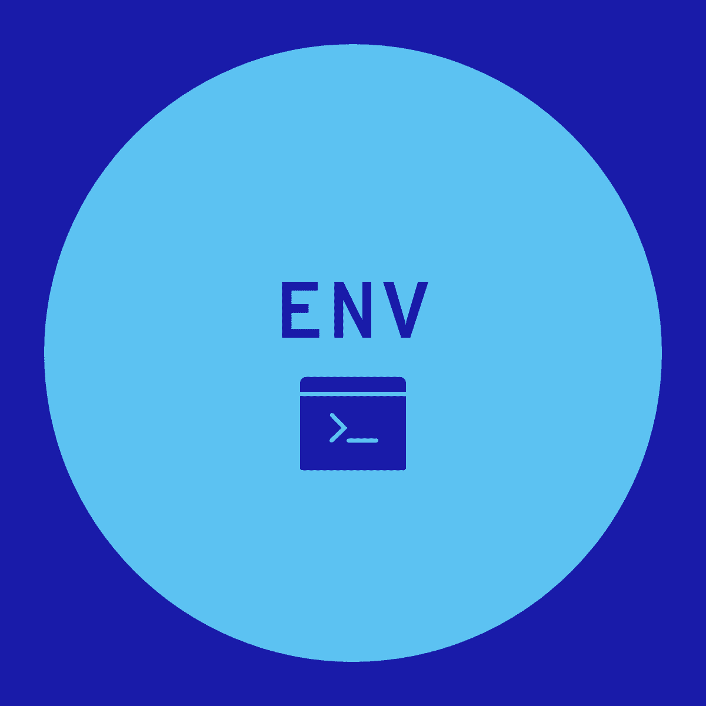

# VSCode Extension: Status Bar Env Var

Display system environment variables in the VSCode status bar and overwrite them easily.

## Limitations

This extension only runs locally and not in remote environments. This means that when using a remote environment the environment variables displayed are those of the local machine running the VSCode UI and not those of the remote VSCode Server.

Overwritten environmental variables are only applied to shell environmental variables, not the VSCode built in ${env} variable.
To use the variables in tasks or launch configurations, use the built in shell variables.

## Install

https://marketplace.visualstudio.com/items?itemName=leighmcculloch.status-bar-env-var

## Usage

In the settings specify a list of environment variables that should be displayed in the status bar. The status bar will update immediately to show the variable name and value.
Each environmental variable can have an optional list of options to allow quick switching between preset values and a comment to clarify what it is used for. Following format is used:

```
NAME[option1, option2, ...]#comment
```

The value of each configured environmental variable can be overwritten by clicking on it's status bar item or launching the "Set value of a configured environmental variable" command.
